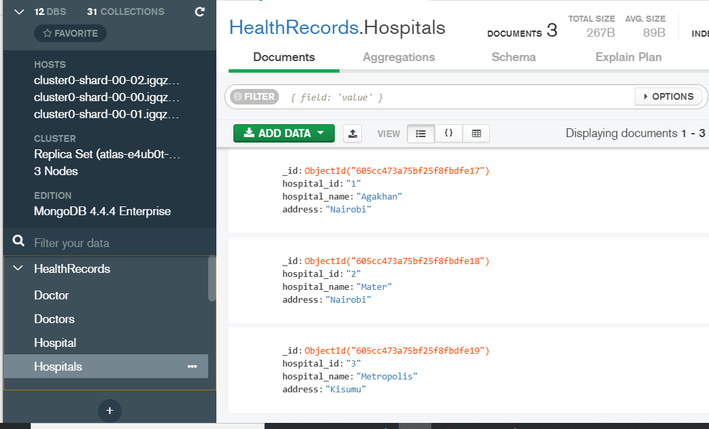
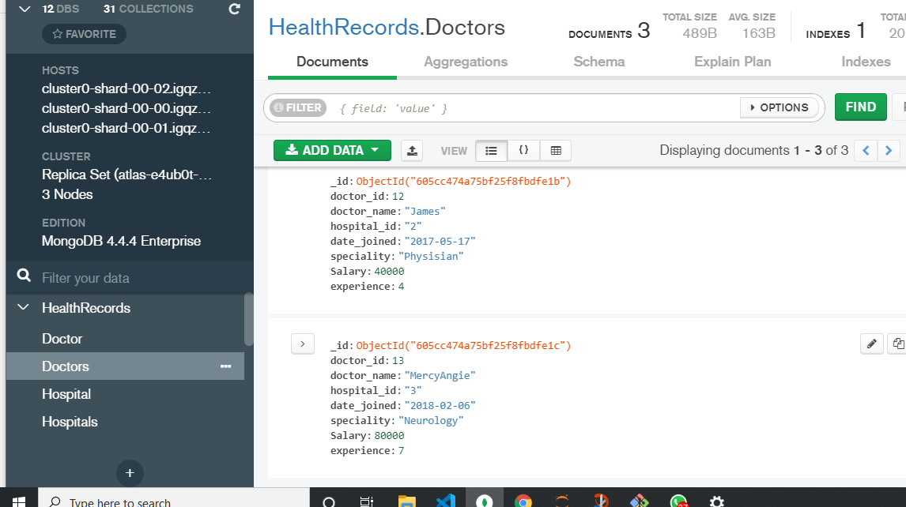
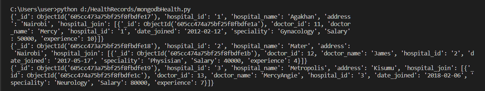
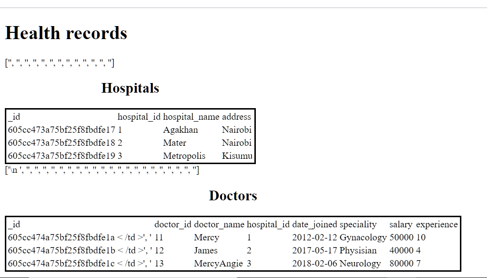

# HealthRecords
### On MongoDB      
NoSQL database project for the healthcare industry hosted in [mongoDB Atlas](https://www.mongodb.com/cloud/atlas)     
The collectins can be viewed locally using **MongoDB Compass** as illustrated below:

##### Hospitals Collection

##### Doctors Collection

### mongodbHealth.py
Written in [Python 3.9](https://python.org) and [mongoDB NoSQL](https://www.mongodb.com/)     
Libraries imported are **pymongo**, **dns** and **webbrowser**  
The following is the procedure followed in the code:
- Connect to mongodb atlas server.
- Create the database
- Create the collections
#### createcols()
- Inserts documents into the collections from a list of dictionaies.
#### joincols()
- Joins the 2 collections using the *hospital_id* and displays the documents on the terminal as shown below:
##### Joined Documents

#### displayhtml()
- Displays the collection on a web browser as shown:
##### On Google Chrome

